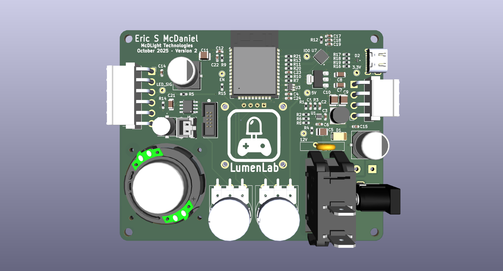
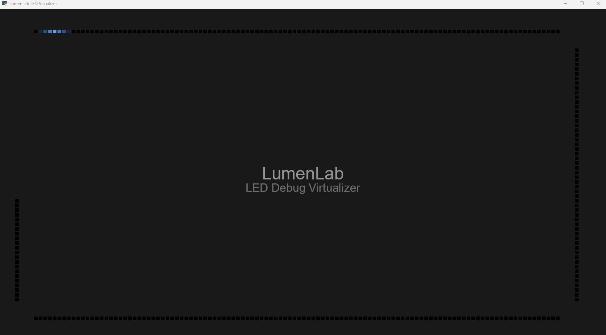

  <picture>
    <source media="(prefers-color-scheme: dark)" srcset="assets/lumenlab-logo-dark.png">
    <source media="(prefers-color-scheme: light)" srcset="assets/lumenlab-logo.png">
    
  </picture>

Transforming pixels into a playground

---

__LumenLab__ is an LED strip gaming and entertainment platform designed to transform your space into an interactive playground of light. Powered by an ESP32 microcontroller, displayed through a NeoPixel addressable LED strip, and controlled by a PlayStation 3 game controller, LumenLab brings simple, one-dimensional retro arcade-style games, animations, and ambient lighting to life.
 

# Features

LumenLab is composed of two modes. The central mode is its suite of games, but the platform also supports animations and ambient lighting, called scenes. After all it's still an LED strip!

## Games
Using an LED strip as a gaming platform is a unique concept due to the constraint of only having one dimension to interact with. Since *only* the landscape x-axis is available, this constraint compels players to apply creative interpretation during gameplay. This of course is not a modern, feature rich AAA blockbuster with 4K graphics, immersing you in the vision of a world crafted by others. Instead, LumenLab's restriction subtly encourages players to philosophically revisit what it *really* means to play a game down to the core. In its purest form, a game player follows rules and explores boundaries in pursuit of a goal. Gamers encounter conflict and must experiment and adapt to their environment to overcome obstacles. LumenLab forces players to abstractly experience digital gaming at its rawest, most atomic form: structured uncertainty and strategy until mastery is achieved. This has become the manifesto of the LumenLab. **Every individual playing its games has a unique mental concept of what they're experiencing.**

Because LumenLab is restricted to a single dimension composed of an array of LEDs, it's aesthetically reminiscent of retro arcade games. However, LumenLab exploits capabilities unavailable on old 8-bit game consoles. These capabilities include its ability to generate any arbitrary RGB color instead of being limited to 256 colors. Additionally, its UI takes advantage of the broad range of controls and state offered by the PS3 controller such as the number of buttons available and precise analog joy stick/trigger positions, contrasting from a cabinet arcade with only four discrete buttons. There are over six games, each detailed below.

| **Title** | **Description** |
| --- | --- |
| **Recall** |*Recall* is an adaptation of Hasbro's fifty-year-old game [*Simon*](https://en.wikipedia.org/wiki/Simon_(game)), chosen for its familiarity and simplicity. Players easily recognize the format, making it a natural fit for LumenLab’s constraints. Similar to the original, the LED strip flashes a color, and the player must press the matching button on the PS3 controller. Each round adds another color to the sequence, which must be recalled in full and in order.|
| **Phase Evasion** | *Phase Evasion* is a game inspired by Google Chrome's [*Dinosaur Game*](https://en.wikipedia.org/wiki/Dinosaur_Game), replacing jumping and ducking obstacles with color-based evasion. You are a solid-colored specter pursued by incoming flares. To survive, you must phase shift to match each flare’s color and blend in to evade capture. As the game progresses, the flares accelerate, testing reflexes and timing.  *In development.* |
| **Light Strike** | *Light Strike* combines the spirit of Atari's [*Space Invaders*](https://en.wikipedia.org/wiki/Space_Invaders) with elements of [*Asteroids*](https://en.wikipedia.org/wiki/Asteroids_(video_game)). As a lone agent in deep space, you enounter waves of predators approaching you from directions sides at varying speeds. Moving freely across the x-axis, and your survival requires defending yourself with your laser pistol. Conserve your ammunition however, your weapon can only fire so many rounds a minute!  *In development.* |
| **Reflex** | *Reflex* is a fast-moving inspired by the modern arcade game [*Pop the Lock*](https://www.baytekent.com/pop-the-lock/), testing precision and timing under pressure. A moving marker sweeps across the field toward a shifting target. Fire at the perfect moment to score a hit. Each success quickens the pace, reverses the marker's direction, and relocates the target to a new random location. Survive fifty flawless shots to win.  *In development.* |
| **Spectrum** | *Spectrum* tests your perception of color and precision of control. A random RGB color appears on one end of the display, and you must use the analog stick to recreate it as closely as possible. The closer your match, the higher your score.  *In development* |
| **Pursuit** | *In development.* Details to be provided soon. |

There are more game ideas in the works, and ideas for some *two-player* games are being considered.

## Scenes

An LED strip entertainment platform would not be complete if it did not include animations and special effects libraries. Inspired by the [WLED project](https://kno.wled.ge/), LumenLab is able to create captivating scenes. Many of them are interactive, for example moving the joystick can change the color, or pressing the directional buttons can change timing.
| **Title** | **Description** |
| --- | --- |
| **Canvas** | *Canvas* lets you choose any color across the RGB range, turning the LED strip into a fully personalized ambient light.  *In development.* |
| **Tempo** | *Tempo* allows you to choose a tempo and strobe lights and trigger light subroutines in response to music.  *In development.* |
| **Police Siren** | Strobing red and blue lights to look like a law enforcement vehicle.  *In development.* |
| **Halloween** | Spooky orange and some purple.  *In development.* |
| **Christmas** | Festive red and green.  *In development.* |

And more to come.

---

# Experience the Lights in Your Home
Being a hardware-forward project, it is not possible to experience LumenLab without physically having the device. Your options include either having a PCB professionally manufactured and assembled, or soldering your own prototype on a breadboard or perf board using off-the-shelf components.

This guide will walk through both options and their practicality.

## Method A: Professionally Manufactured and Assembled

A custom PCB was designed using KiCad 9 and gives LumenLab a clean aesthetic. All of the schematic files, PCB layout files, BOM, custom symbol libraries, footprints, 3D models, and Gerber files are all found in the `/board` directory. The PCB layout uses the manufacturing capabilities given by [PCBWay](https://www.pcbway.com/). Although you can potentially use any board house of your choosing, the ECAD model was designed with PCBWay's capabilities in mind. Production costs were minimized as much as safely reasonable, such as keeping it's width under 100mm. However for the amount of current that it can potentially consume, thermal safety was factored in, leading to a four-layer design with extra forgiving trace width and copper pours. My manufacturing costs were roughly $50 for ten boards. If you choose to have this manufactured else where, you must adjust for the capabilities of that board house. Your mileage may vary, and by quite a bit too.

<i>Figure 1: Front of PCB layout</i>

You can view the KiCad schematic, PCB layout, BOM, and 3D rendering of the PCB design [in the *board* directory.](./board/)

## Method B: Hand-Soldering a Prototype

This is the more accessible and classic route especially for DIY enthusiasts, however this can be tricky depending on your background with electronics. Below is the prototype BOM if you'd like to build LumenLab yourself using pre-built modules, THT components, and a breadboard or perfboard. If you're an advanced electronics enthusiast, you may even be able to omit some of the suggestions, such as skipping the buck converter, directly powering the LED strip, and using the 5V power directly from the Vin pin to level shift the LED strip's data signal. These "barebones" alterations are not discussed in this document.

Assembly is remarkably similar to the guidance given on the WLED project. Using their [wiring diagram here](https://kno.wled.ge/basics/wiring-guides/) would be an excellent starting point.

#### 
Bill of Materials

|  Device | Description |
| --- | --- |
| ESP32 WROOM microcontroller | Only the [WROOM variants](https://docs.espressif.com/projects/esp-dev-kits/en/latest/esp32/esp32-devkitc/index.html) are supported because those are the only variants that support the Bluetooth classic protocol (BR/EDR). You **cannot** substitude the WROOM with other variants, as they all only have support for BLE. |
| WS2815 LED light strip | The 12V variant of the NeoPixel addressable RGB WS2812B. This project uses the 5m (16.4ft), 300 LED strip in black. |
| 12V 10A DC power supply | The 10A supply is required due to the high current demands of displaying white at full brightness. 120W is only the peak power draw, but this typically runs much lower. |
| MP2338 buck converter | Any step down regulator will suffice as long as it outputs 5V and at least 1A. The MP2338 can deliver 2-3A, enough to reliable power the ESP32 during intense gameplay and Bluetooth connectivity. |
| SN74AHCT125N logic level shifter | The ESP32's GPIO lines work using 3.3V signals. Level shifting to 5V ensures that the LED strip's data lines are not lost or corrupted. |
| PlayStation 3 game controller | The input device to navigate the main menu and play games. |
| SSD1306 OLED display module | Using the 0.96" variant, this displays the main menu for mode selection and in game mode is a HUD showing basic statistic like the user's high score. |
| Passive components | Resistors, capacitors, diodes, and fuses as needed for power protection, power stability and smoothing, low-pass filtering, and signal damping to minimize ringing. Refer to your MCU and buck converter's datasheet for guidance on what passives are needed. |

# Software

Regardless of whether your build of LumenLab was professionally manufactured and assembled, or hand-soldered to a perf board, the software is identical between the two approaches. To build this project from scratch, you at minimum need the following frameworks and dependencies:

* **PlatformIO**: A feature-rich ecosystem for embedded development. This framework includes the C/C++ compiler (avr-gcc) needed for MCU development. You can use the toolchain CLI directly, but installing the Visual Studio Code extension is significantly more approachable. [Download PlatformIO here](https://platformio.org/).
* **Python3** (&GreaterEqual;3.6): A dependency of PlatformIO to compile and flash the device. Also used in the virtualizer for local development.

## LED Strip Virtualization

To streamline the software development cycle, a virtualizer was created so that you can simulate what the LEDs would be displaying, but on your computer screen. This enables new features to be developed in comfort without needing to physically connect to the LED strip. Using the ESP32 is still required for development regardless since it's just an emulator for what the ESP32 is actually doing in real time.

When compiling in debug mode, the ESP32 does not transmit color signals to the LED strip and instead sends its color data via USB serial for virtual rendering. When compiling in release mode, the virtualizer and logs are removed. This virtualizer was created using Python, and uses the [ModernGL](https://moderngl.readthedocs.io/en/5.8.2/) library, an OpenGL binding for Python.

<i>Figure 2: Development Virtualizer of two controllable entities, simulating what the LED strip would be rendering</i>

## Building the Repository
This section was redacted temporarily because of how rapidly the code base is evolving. The instructions I wrote no longer apply as the Virtualizer was rewritten for speed to send color data via a USB serial connection instead of an open WebSocket connection. Stay tuned.
