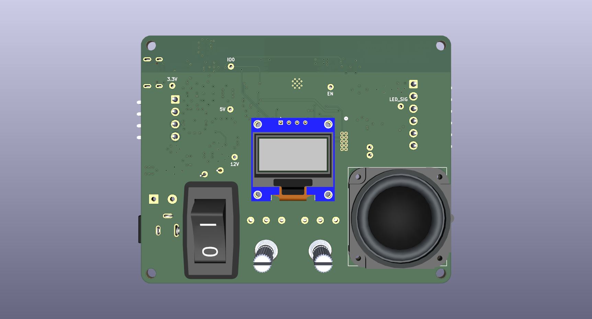

# Custom PCB Fabrication

The LumenLab was built in two phases. The first phase (labeled as "Version 1") was a prototype that used through-hole components hand-soldered on to several perf boards. This worked especially for making progress in the early stages of the software development, however the components did not work exactly as desired, making its maintanance more of a hassle than it was a benefit. Designing a PCB to be professionally manufactured became a clear and obvious choice, allowing the LumenLab to be scaled into a clean, stable device.

The LumenLab PCB was designed using KiCad 9.0.2

# Schematic

Figure 1. LumenLab schematic and electronic layout

# Bill of Materials
Still to be finalized, however you can [view the tentative list of components here](./bom/ibom.html).

# PCB Layout
Still to be finalized. Components were placed but still need to be routed and/or have copper pour areas defined.

# 3D Preview

<i>Figure 2: PCB layout (front)</i>

<i>Figure 3: PCB layout (back)</i>

A 3D enclosure will be created to give the final device a clean look.