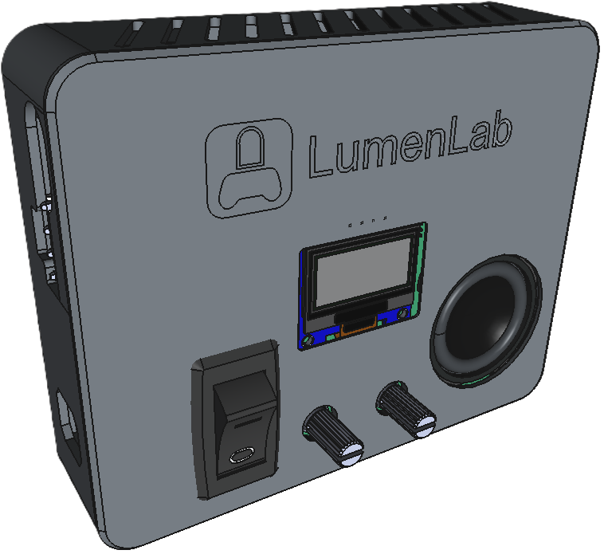
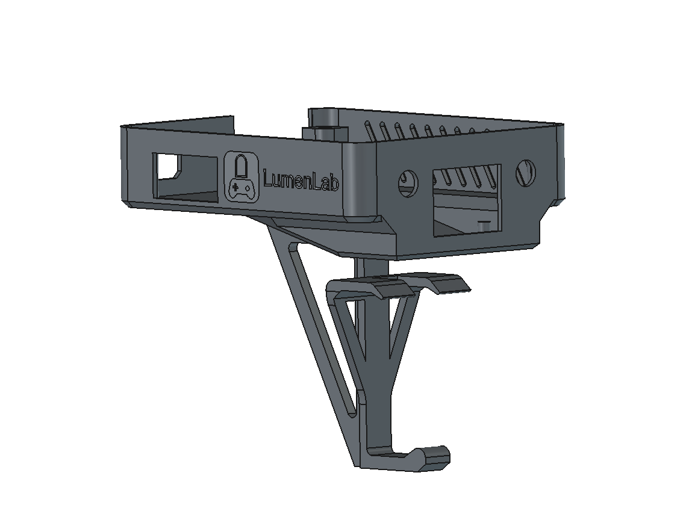
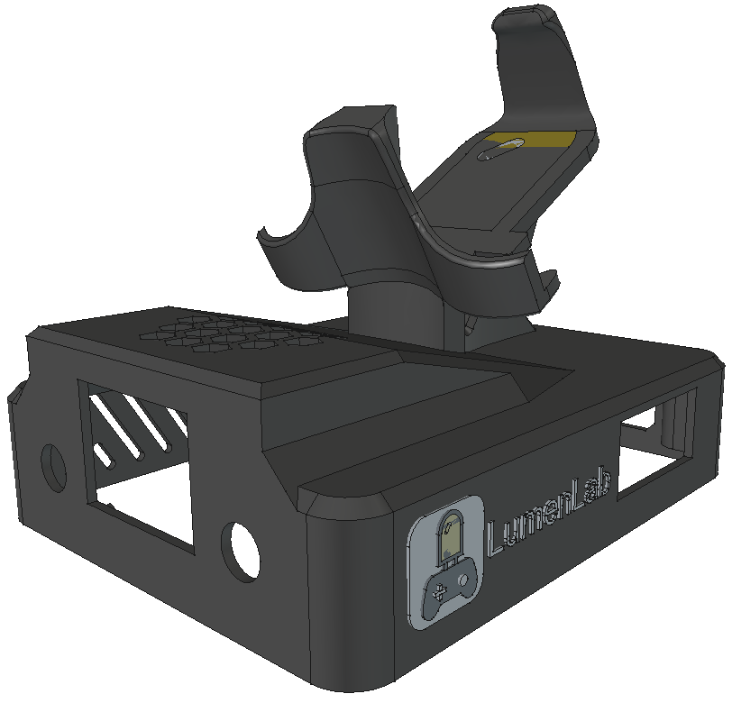
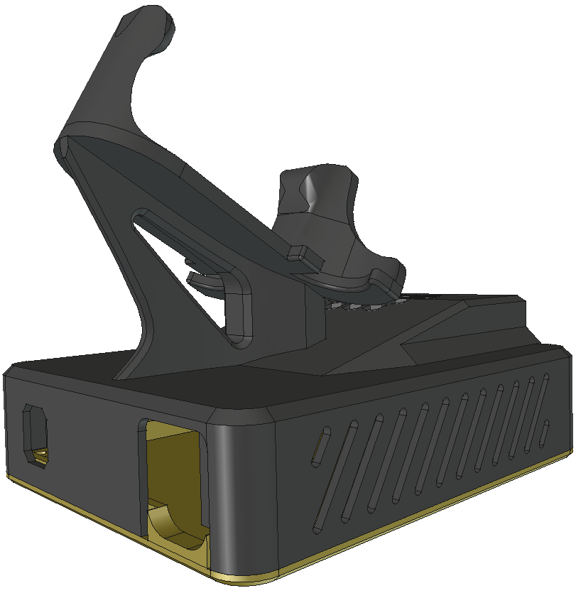
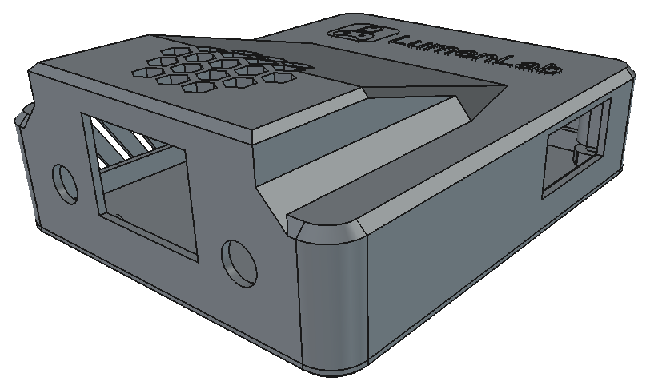
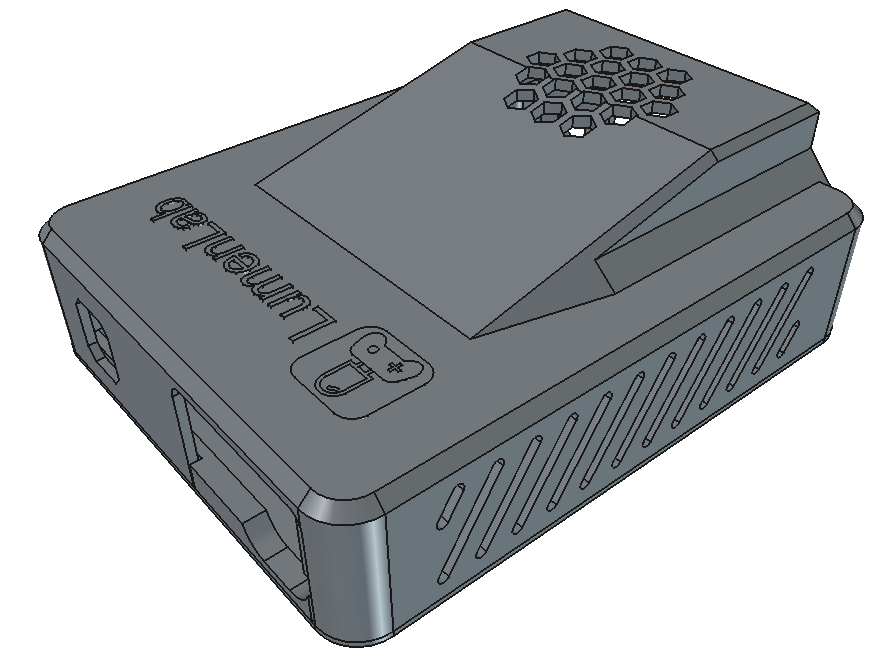

# 3D-Printed Enclosure

### Prototype Version 1

The enclosure can be 3D-printed in multi-color and single-color 3D printers. The lid is printed separate from the body.

### Prototype Version 2

For my second build, the LumenLab will be installed hanging upside-down to preserve shelf space. It features a controller mount so that you can return the controller after use.

# Current Version (v3)

My previous design serves me well for my exact situation, but it isn't an ideal solution for most people. This last version is the same as before, but flipped upside down so that it can become a platform gaming system. Resting it on a shelf or countertop allows you to leave it in place without permanently mounting it on your walls or furniture.

*Front edge angle of the LumenLab enclosure v3, with a controller saddle*

*Rear edge angle of the LumenLab enclosure v3, with a controller saddle*

*Front edge angle of the LumenLab enclosure v3, no controller saddle*

*Rear edge angle of the LumenLab enclosure v3, no controller saddle*
