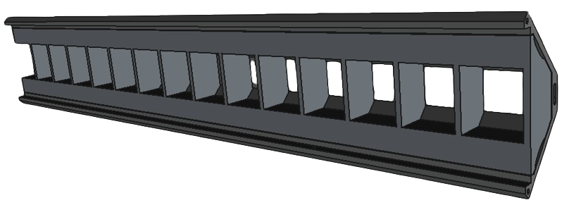
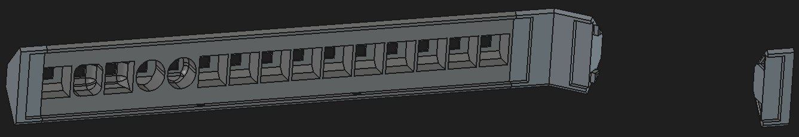
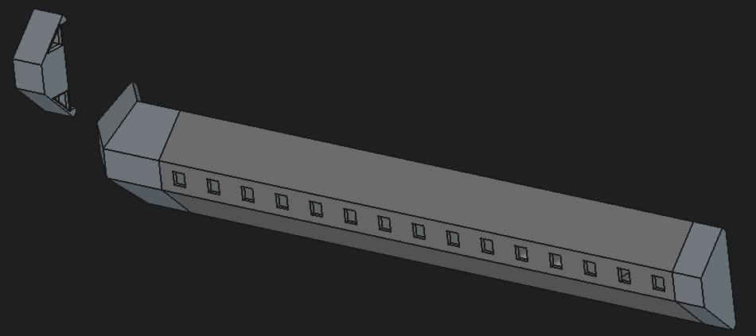

# 3D-Printed Mounting Bracket

A bracket so that you can mount these on the corner. It's assembled from two pieces. The first is the actual bracket which you fasten the LED strip to, on to the wall. In replacement of the classic aluminum rails, this bracket requires a black LED acrylic sheet cut to 34mm by 250mm (or more).

I went forward with the [Chemcast Black LED Acrylic Sheets from California-based TAP Plastics](https://www.tapplastics.com/product/plastics/cut_to_size_plastic/black_led_sheet/668) for <$20, however you can purchase from any supplier as long as the rail length is strictly 34mm. The width can be any size you set your bracket to.

### Version 2

Still experimental, but some tweaks were made on how the LED is placed within each cell.

#### Front

#### Back
