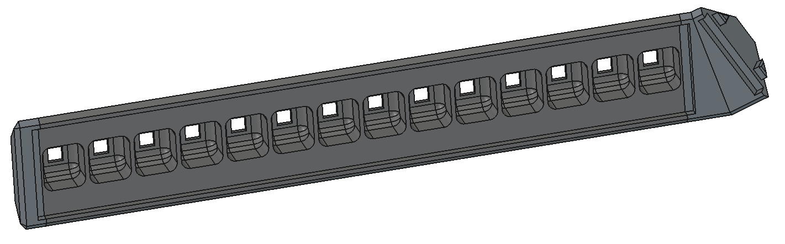
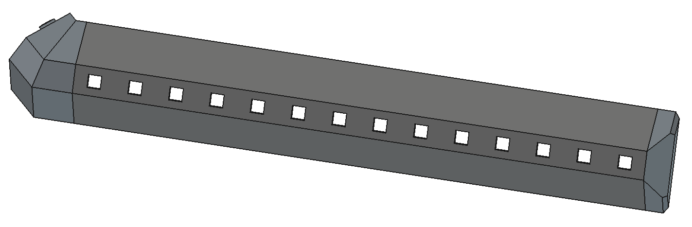
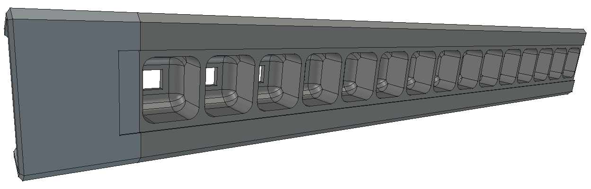
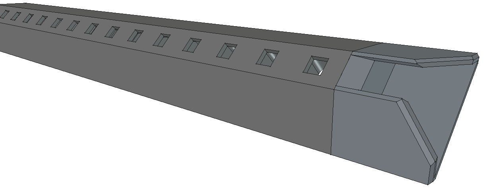

# 3D-Printed Mounting Bracket

A bracket so that you can mount these on the corner. It's assembled from two pieces. The first is the actual bracket which you fasten the LED strip to, on to the wall. In replacement of the classic aluminum rails, this bracket requires a black LED acrylic sheet cut to 34mm by 250mm (or more).

For this early prototype model, I went forward with the [Chemcast Black LED Acrylic Sheets from California-based TAP Plastics](https://www.tapplastics.com/product/plastics/cut_to_size_plastic/black_led_sheet/668) for <$20, however you can purchase from any supplier as long as the rail length is strictly 34mm. The width can be any size you set your bracket to.

## Prototype Version 2

Still experimental, but some tweaks were made on how the LED is placed within each cell.

#### Front

#### Back

## Version 3

This version abandons the LED black acrylic diffuser in favor of a different diffuser. The acrylic looks fantastic, however it makes all the edges blurry. With that material, I can't get crisp edges while full diffusion of color, avoiding LED hotspots. I found another diffusion material meant for photography, but it comes in paper-sized sheets and needs to be cut to size. To reduce cost, I changed the geometry of the face where the acrylic get applied, saving material cost.

Additionally, the end caps were refined so that there is space for decoupling capacitors right at the start (and end) of the LED strip. This is done directly on the board as well, but this is an additional smoothing layer so that I don't have to be extremely limited on the length of the cable leading to the LED strip.

As with the previous design, the LEDs are placed behind the cavity. If that side faces outward in any way and is visible, black electrical tape can be applied on the back to side the LED strip (assuming you print in black).

#### Front

#### Back
